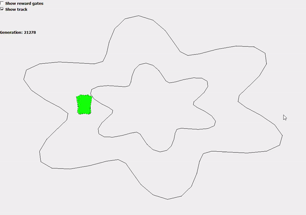
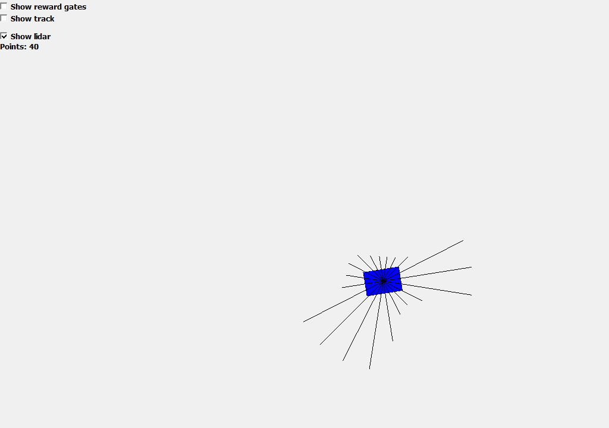
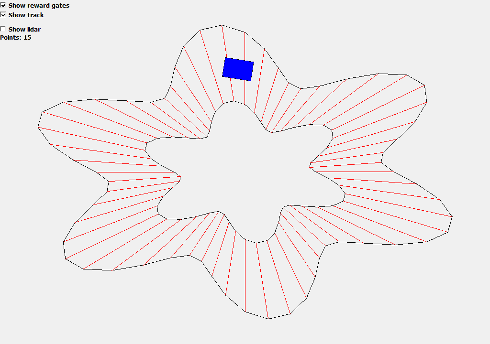

# 2D Car Game With Genetic Algorithm

This is a 2D Car Game written C++ with Qt. 

The game is a topview game, where you have to go through a generated car track, and collect 100 rewards through reward gates. You can play alone, or against a learning genetic algorithm. Find out who learns the track faster. You can visualize only the genetic algorithm either.

## Fun facts
* You can hide the track, and try to go through it by only using a lidar

* You can visualize the reward gates, that gives the points

## How to try
The git repository contains a prebuilt executable for windows. To test it:
* Download the bin.zip folder
* Unzip the bin.zip folder
* Start bin/2DCarGame.exe
* Click on "Show only AI"

INFO: If it does not work, install bin/vc_redist.X64.exe

## Built With

* Qt Creator - IDE used
* [Qt](https://www.qt.io/) - User interface
* [cmake](https://cmake.org/) - Built with cmake
* [windeployqt](https://doc.qt.io/qt-5/windows-deployment.html) - Windows Deployment Tool

## Authors

* **Kardos Tamás** - *Initial work* - [Swordy](https://github.com/swordey)